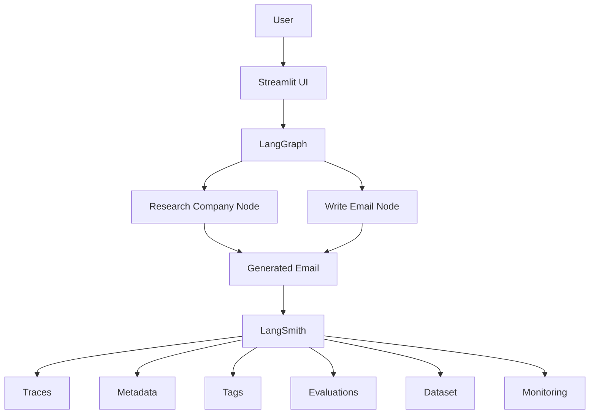
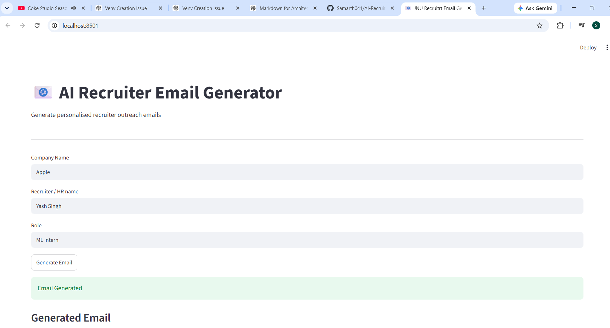
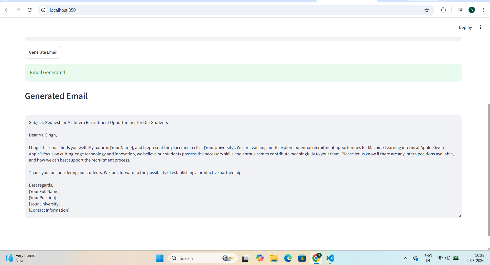
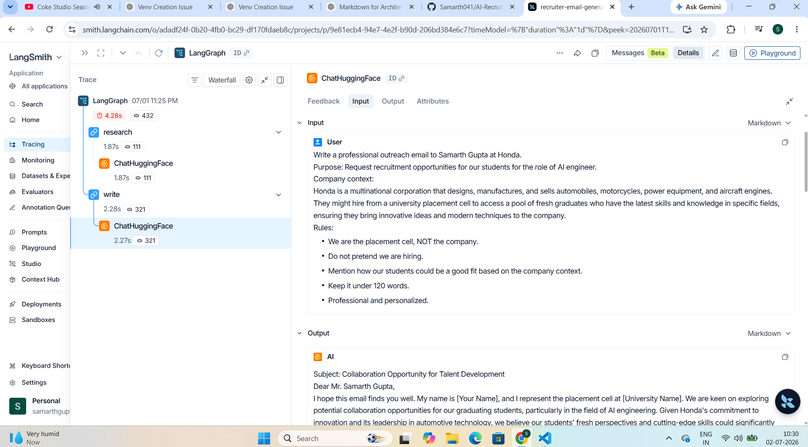
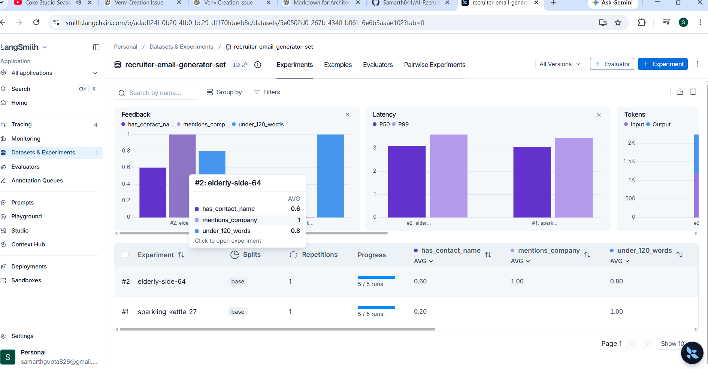
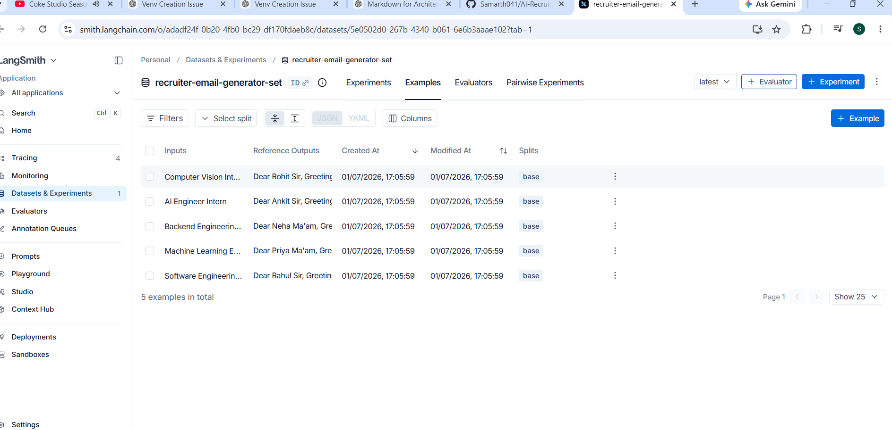
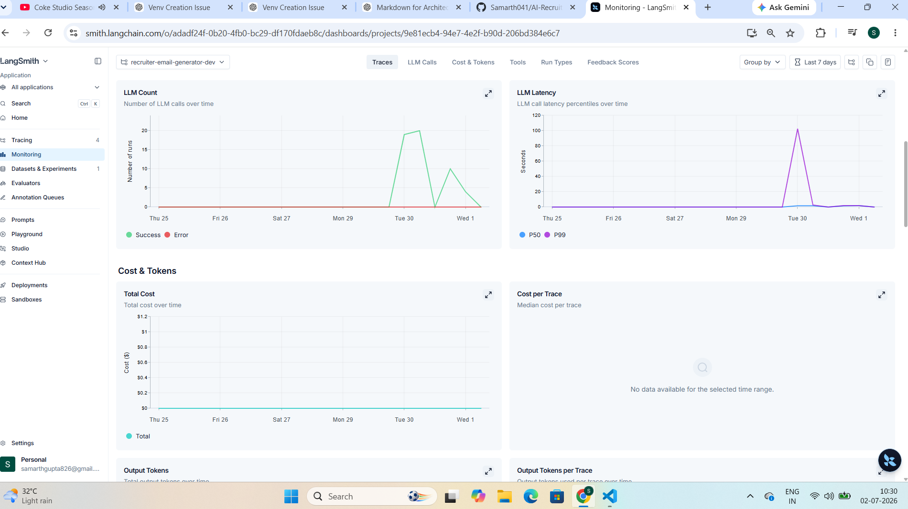
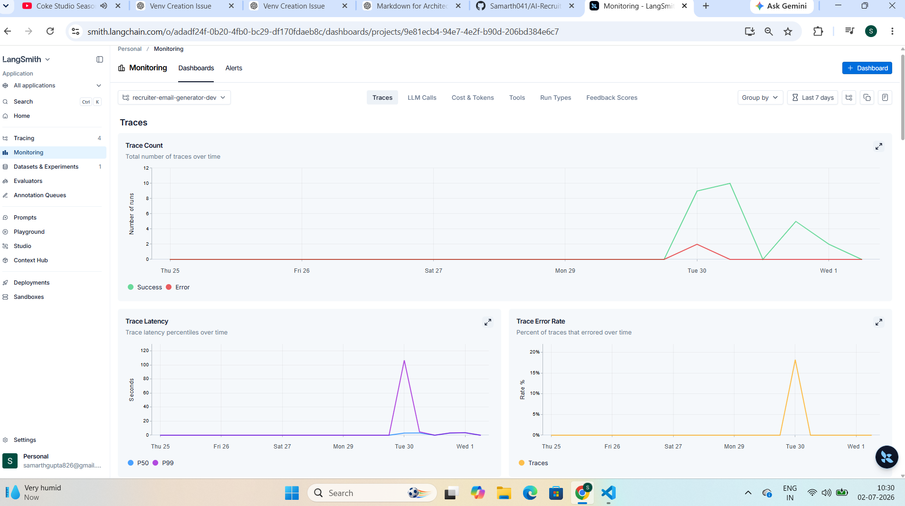

# 📧 AI Recruiter Email Generator

<p align="center">
  
  
  
  
  
  
  
  
  
</p>

<p align="center">
  
  
  
  
</p>

---

## 📝 Overview

A **LangGraph-powered AI application** that automatically generates personalized recruiter outreach emails for university placement cells. The system first *researches* a target company and then *drafts* a professional email tailored to the company and role.

This project was also built to learn and apply **LangSmith** for tracing, evaluation, dataset management, human feedback, and observability in AI applications.

---

## ❓ Problem Statement

Writing personalized recruiter outreach emails manually for dozens of companies is repetitive and time-consuming.

This project automates that workflow while maintaining **personalization** through a *two-step AI pipeline*.

---

## 🏗️ Project Architecture



---

## 🧰 Tech Stack

<p align="left">
  
  
  
  
  
  
  
</p>

---

## 🔄 Workflow

1. **User enters**
   - Company
   - Recruiter Name
   - Role

2. **Research Node**
   - Collects a short description of the company.

3. **Email Generation Node**
   - Uses the company context to draft a *personalized* outreach email.

4. **LangSmith**
   - Records the *complete execution*.

---

## 📁 Project Structure

```text
AI Recruiter Email Generator
│
├── recruiter_agent.py
├── recruiter_agent_metadata.py
├── app.py
├── create_dataset.py
├── evaluate_agent.py
├── feedback.py
├── requirements.txt
├── README.md
└── .env
```

---

## ⚙️ Installation

### 1. Clone the repository

```bash
git clone https://github.com/Samarth041/AI-Recruiter-Email-Generator.git
cd AI-Recruiter-Email-Generator
```

### 2. Create a virtual environment

**Windows**

```bash
python -m venv venv
venv\Scripts\activate
```

**macOS / Linux**

```bash
python3 -m venv venv
source venv/bin/activate
```

### 3. Install dependencies

```bash
pip install -r requirements.txt
```

### 4. Create a `.env` file

Create a file named `.env` in the project root.

```env
HF_TOKEN=your_huggingface_api_key

LANGSMITH_API_KEY=your_langsmith_api_key
LANGSMITH_TRACING=true
LANGSMITH_PROJECT=recruiter-email-generator-dev
```

If you want to use **Gemini** instead of Hugging Face:

```env
GOOGLE_API_KEY=your_google_api_key
```

### 5. Run the Streamlit application

```bash
streamlit run app.py
```

The application will open in your browser.

### 6. (Optional) Create the LangSmith dataset

```bash
python create_dataset.py
```

### 7. (Optional) Run evaluation

```bash
python evaluate_agent.py
```

This evaluates the generated recruiter emails against the **stored LangSmith dataset**.

---

## 🔍 LangSmith Features Implemented

### 1. Tracing
- Traced every LangGraph node execution
- Inspected prompts, outputs, latency, and errors

### 2. Metadata
Attached metadata such as:
- `company`
- `company_type`

to every run for filtering.

### 3. Tags
Used tags like:
- `first-contact`
- `follow-up`
- `streamlit-ui`

to organize runs.

### 4. Dataset Creation
Created a **golden dataset** containing manually approved recruiter emails for multiple companies.

### 5. Automated Evaluation
Implemented custom evaluators to verify:
- Email length
- Company name mention
- Recruiter name mention

### 6. Human Feedback
Added feedback annotations using LangSmith's **feedback API** to record manual quality assessments.

### 7. Production Monitoring
Monitored:
- Latency
- Run count
- Token usage
- Trace history

through the LangSmith dashboard.

---

## 💡 What I Learned

Through this project I learned how **production AI applications** are developed beyond prompt engineering. I implemented *observability* using LangSmith, built *datasets* for regression testing, created *custom evaluation metrics*, monitored application performance, and integrated LangGraph for *workflow orchestration*. The project gave me practical experience with the **AI development lifecycle** — from prototyping to evaluation and monitoring.

---

## 🚀 Future Improvements

- Retrieval-Augmented Generation (RAG) for company research
- Company website scraping
- Resume-based personalization
- PDF brochure attachment
- Gmail API integration
- Multi-agent workflow
- Batch email generation
- Deployment on cloud

---

## 🛠️ Skills Demonstrated

### 🧠 AI & LLM Engineering
- Prompt Engineering
- AI Agent Development
- Workflow orchestration with LangGraph
- Multi-step LLM pipelines
- Context-aware email generation

### 🔎 LangSmith
- End-to-end tracing
- Custom metadata and tags
- Dataset creation
- Automated evaluation
- Custom evaluators
- Human feedback integration
- Experiment tracking
- Production monitoring

### 🐍 Python
- Object-Oriented Programming
- Type Hints
- Environment variable management
- Modular project architecture

### 🔌 APIs & Frameworks
- Hugging Face Inference API
- LangChain
- LangGraph
- LangSmith SDK
- Streamlit

### ⚙️ Software Engineering
- Modular code organization
- Configuration management using `.env`
- Evaluation-driven development
- Regression testing
- Git & GitHub version control

### 🌐 Web Development
- Streamlit UI development
- Interactive form handling
- Real-time AI response generation

---

## 📸 Application Screenshots

### 1. Home Page


### 2. Generated Email


### 3. LangSmith Traces


### 4. LangSmith Experiment


### 5. LangSmith Dataset


### 6. LangSmith Dashboard


### 7. LangSmith Evaluation


---

## 👨‍💻 Author

**Samarth Gupta**

- **AI & Machine Learning Enthusiast**
- Passionate about *Generative AI*, *Agentic AI*, and *LLM Applications*
- Building practical AI projects with LangGraph, LangChain, and LangSmith
